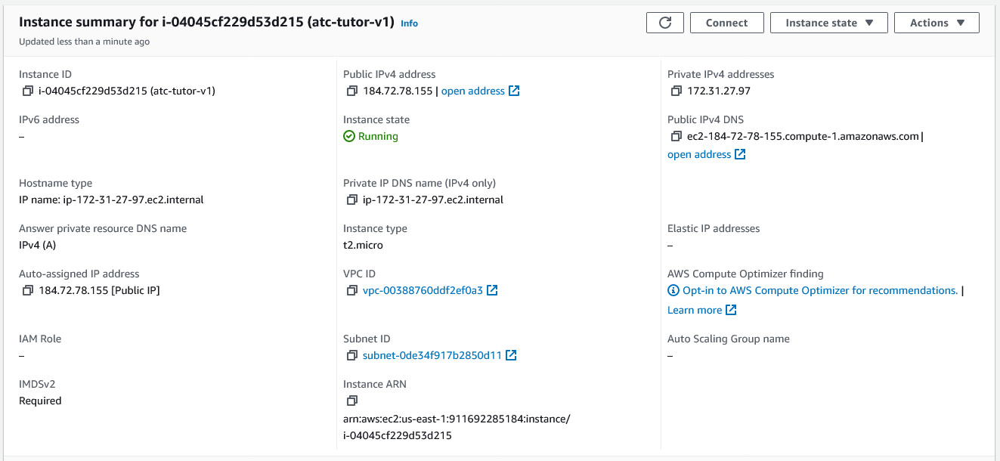

# Setting Up an AWS EC2 LAMP Server

## Get a (free or cheap\!) DNS Name For Your Web Apps

If you plan to be a web developer, now may be a good time to buy a *yourname.com* domain or a cheap name from Namecheap or similar. If you already have one, feel free to use it, or a subdomain (*webapps.yourname.com*) if it's already in use.

 A free (or low cost) domain can be found here (when they feel like giving you one\!):

* https://education.github.com/pack  
* https://www.getfreedomain.name/  
* http://www.dot.tk/en/index.html?lang=en  
* https://www.namecheap.com/

## A Quick Note

The content which follows contains commands which you will enter to install various programs on your PC or on your EC2 instance. **Unless otherwise stated, each command will be entered on a single line.**

## Launch and Configure an EC2 Instance

### Launch an EC2 Instance

Under *Application and OS Images*, be sure to choose **Amazon Linux 2 AMI (HVM)**. Selecting a different AMI increases the difficulty of configuring the instance, as some of the options will not match the instructions given in the lecture.


If you're creating this instance as part of your AWS Academy training, you should have an existing SSH key, called *vockey.ppk*, which you can download from your AWS Academy portal. If not, you can create a new SSH key now, following the instructions below.

### Creating a Key Pair (Optional)

Under the *Key Pair (login)* section, click the *Create new key pair* button:


In the dialog which opens, give your key a name:


For this document, we named the file *grcc-rsa-keyfile.pem*. Click *Create key pair* and select an easy-to-find location for your file when prompted. We recommend saving it to the root of the folder where your course files are located.

### Set Key File Permissions

To use your key file in an SSH connection, you'll need to make sure that the file's security permissions are such that only your current user has access.

#### Linux and macOS

The process for setting file permissions in the Linux and the macOS operating systems are the same. First, open the terminal application. Then, enter the following command (replacing *key-pair-name.pem* with the full path to your key file):

`chmod 400 key-pair-name.pem`

**That's it\!** Continue to *Completing Set Up*.

#### Windows

1. Locate the key file in Windows Explorer.   
1. Right-click on the file, then select the ***Properties*** option.   
1. In the dialog which opens, click the ***Security*** tab and click the **Advanced** button.   
1. Click the **Disable inheritance** button.   
1. Remove access to all users except for the current user:  
   1. Click on a user to remove.  
   1. Click the **Remove** button.  
   1. Repeat until only your current user remains in the list.  
1. Click **OK** to close the *Advanced Security Settings* window.  
1. Click **OK** to close the *Properties* window.

**All done\!** Continue to *Completing Set Up*.

### Completing Set Up

**Almost done\!** Under *Network Settings*, ensure that all three Firewall options are checked:


This will allow the wizard to create the correct inbound rules to allow your EC2 instance to receive HTTP and HTTPS requests.

Click the *Launch instance* button to initiate the creation of your EC2 instance\! Once the process completes, find and click on the instance identifier (*i-xxxxxxxxxxxxx*) in the success message:


Clicking that link will take you to the overview of your new instance:



**Next up:** allocating a “permanent” IP address to your instance using Elastic IP.

### Allocate an Elastic IP address and associate it with your EC2 instance.

#### Allocate an Elastic IP address

1. On the left side of your browser window, look for the section labeled *Network & Security*, and then click on the *Elastic IPs* option:  
     
1. In the upper right corner of the next page, click on *Allocate Elastic IP address*.   
1. Leave all settings at their default and click the *Allocate* button. This will allocate an IP address to your account from the pool of available IP addresses.   
1. Once the page has reloaded, check the box for your new IP address, then find and click the *Actions* button in the upper right corner of your browser.   
1. Click *Associate Elastic IP address*.   
1. In the page which loads, leave the *Resource* type as *Instance*.  
1. For the *Instance* field, click in the textbox labeled *Choose an instance*, which will load all of your current EC2 instances (you should have only one instance at this time).   
1. Choose your running instance, then click the *Associate* button.  
1. Your instance now has a “permanent” public IP address \- we'll use this from now on.

#### Point Your Domain at Your EC2 Instance

In your domain manager, create an A record using your public (Elastic IP) address. It's recommended to also create a CNAME record \- this allows you to point both [http://yourdomain](http://yourdomain) and [http://www.yourdomain](http://www.yourdomain) at your EC2 instance. For this document, we added the following records:

* **A Record**  
  * **Host:** @  
  * **IP address:** (your public Elastic IP address)  
      
* **CNAME record**  
  * **Host:** www  
  * **Target:** yourdomain.tld (replace with the domain you've registered)  
    

Your settings will vary based on the domain registrar where you acquired the domain.

## Connecting to Your New Server

You can connect to your server in many ways, but let's look at two of them, WinSCP and the terminal. As the name suggests, WinSCP is only on Windows, but there are comparable programs available for Mac. How you connect is up to you, based on your personal preferences.

### Using WinSCP

WinSCP is an integrated FTP and SSH client. If you are on a college laptop or on-campus computer, WinSCP is already installed. If you need to download it, you can do so from their website [https://winscp.net/eng/downloads.php](https://winscp.net/eng/downloads.php) and install it as you normally would.

When you open WinSCP, you will see a Login window. In the Host name field, enter your domain name. In the User name field, enter ec2-user and leave the password field blank. Then, click the Advanced drop-down menu.   


In the Advanced Site Settings window, use the navigation panel on the left and click on Authentication, located under SSH, as shown below. We need to create a .ppk file from the .pem file you saved earlier. Open the Tools drop-down menu and choose Generate New Key Pair with PuTTYgen.   


In the PuTTY Key Generator, click the Load button. Navigate to where your .pem file is located and open it.   


The window will change to look like the image below. If you wish to secure your server further, enter a secure password in the Key passphrase field and again in the Confirm passphrase field. You will be prompted for this password each time you login. You may leave the field blank if you wish, but it will be less secure, and a warning will appear when you save the private key. To save the private key, click the Save private key button. Like your .pem file, save it somewhere secure where you can find it again. On a campus computer, you should save it to your J:/ drive in order to access it later.  


Back in the Advanced Site Settings window, the Private key file field should be populated with your .ppk file. If it isn't, use the three dots menu to choose your .ppk file. It should look like the image below. Click OK to continue.  


Double check your settings below and click Save.  
 

In the Save session as site dialog window, you can choose to change your Site name or leave it as default. Then, click OK to finish saving it.  


Now, whenever you open WinSCP, your Login window should look like this. Choose Login to log onto your server. The first time you do, you may be prompted to confirm some settings. If you entered a password for your key file, you may need to enter it.   


Once you clear any prompts, you are connected. You will now see the main window as shown below. The left side is your local computer, and the right side is your server. The location within your file system is shown in the blue bar above the file tree. It should look similar to FileZilla, which most of you are familiar with from your HTML classes. To connect to your server via SSH, you will need to click on the Open session in PuTTY button. 


Again, the first time you do so, you may need to confirm some things in a series of dialog boxes. If you entered a password for your key file, you will need to enter it. If you see the terminal as shown below, you are connected and may skip to the *Set Up LAMP and phpMyAdmin* section.  


### Using Windows

If you're using Windows 11, then you already have everything you need to connect to your EC2 instance \- click the **Start** button, and then type *Terminal*. Open the Terminal application, and then you're ready to skip ahead to *Connect Using SSH*.

If you're using Windows 10 or older, then you have a few options:

* Command line  
* PowerShell  
* Terminal

The command line and PowerShell are already installed on your computer. Terminal is an optional software application which you can install from the Microsoft Store \- follow this link learn how to install the Terminal application: 

[https://learn.microsoft.com/en-us/windows/terminal/install](https://learn.microsoft.com/en-us/windows/terminal/install)

Once your terminal is running, you'll need to verify if the ssh command is available. In the terminal, type:

`ssh`

If you see a “usage” list, then you can proceed to *Set Up LAMP and phpMyAdmin*. If you see an error message, you'll need to install OpenSSH. To install OpenSSH, type (or copy and paste) the following command into the PowerShell terminal[^1]:

`Add-WindowsCapability -Online -Name OpenSSH.Client~~~~0.0.1.0`

You'll see a brief “status bar” message as the tool installs. Once the tool has finished installing you are ready to connect to your EC2 instance\! 

### Using OSX/macOS

To connect to your EC2 instance from an Apple computer, you'll use the Terminal application, found in your *Applications* list. An SSH client should already be installed \- you can verify this by launching Terminal and then typing in the following command:

`ssh`

You should see a help list of arguments for the ssh command.

### Using Linux

To connect to your EC2 instance from a Linux computer, you'll use the terminal (or *shell*) application, typically found in your *Administration* software list \- the location will vary depending on your Linux distribution and the desktop manager which was installed during setup (consult the documentation for your Linux distribution for more details). An SSH client should already be installed \- you can verify this by launching the terminal (press the `Ctrl`\+`Alt`\+`t` keys to open the terminal) and then typing in the following command:

`ssh`

You should see a help list of arguments for the ssh command.

## Connect using SSH

Regardless of the operating system from which you're connecting, the commands which follow will be the same. Within your chosen terminal application, type the following command, replacing *\[/path/key-pair-name.pem\]* with the path to the PEM file you created above and replacing *\[elastic IP address\]* with your site's public IP address:

`ssh -i [/path/key-pair-name.pem] ec2-user@[elastic IP address]`

**You're now connected\!** When you're ready, continue to the next step, *Set Up LAMP and phpMyAdmin*.

## Set Up LAMP and phpMyAdmin

For this next step, we'll be following the process outlined by the article *Tutorial: Install a LAMP server on AL2*,  located at 

[https://docs.aws.amazon.com/linux/al2/ug/ec2-lamp-amazon-linux-2.html](https://docs.aws.amazon.com/linux/al2/ug/ec2-lamp-amazon-linux-2.html) 

We're including the relevant commands here, but for brevity, we're omitting the majority of the tutorial's content. Please take the time to read the source article.

### Connect

If not already connected, connect to your EC2 instance (substituting your values): 

`ssh -i [/path/key-pair-name.pem] ec2-user@[elastic IP address]`

### Install Web Server Software

Run the following commands (each line is a separate command \- run them one at a time):

`sudo yum update -y`

`sudo amazon-linux-extras install mariadb10.5`

`sudo amazon-linux-extras install php8.2`

`sudo yum install -y httpd`

When prompted, enter 'y' to allow the installation of each module.

At this point, you've installed MariaDB (a relational database software), PHP (for creating dynamic websites \- you'll use this in CIS-247), and Apache \- the web server software that allows your EC2 instance to respond to requests from your browser. **Good job\!**

### Start & Configure Apache

We've installed the software we need in order for your EC2 instance to act as a web server, but we need to *start* the software and make sure it starts automatically anytime the instance is started or rebooted.

Run the following commands (each line is a separate command \- run them one at a time):

`sudo systemctl start httpd`

`sudo systemctl enable httpd`

`sudo systemctl is-enabled httpd`

The last command should print “enabled” \- your Apache module is now running\! Open your browser and type your domain into the navigation bar, then hit Enter. Your domain should load the Apache test page:


**Congratulations\!** You now have a working web server\! We're not quite done yet \- we need to update permissions on some files, and make sure that files which you will upload later have the correct permissions automatically.

### Set File Permissions

Run the following commands (each line is a separate command \- run them one at a time):

`sudo usermod -a -G apache ec2-user`

`exit`

That last command, *exit*, will end your SSH session \- reconnect, and then continue with:

`sudo chown -R ec2-user:apache /var/www`

`find /var/www -type f -exec sudo chmod 0664 {} \;`

At this point, you've done the minimum to allow your web server to serve your web pages as you upload them. The next step is to configure your web server to use HTTPS (a secure version of HTTP), taking advantage of the free certificate service Let's Encrypt.

## Encrypt the Connection with Certificate Automation: Let's Encrypt with Certbot on Amazon Linux 2

Let's Encrypt is a service which provides free SSL/TLS certificates, making it relatively easy to enable HTTPS on your web server. If you'd like to learn more, visit [https://letsencrypt.org/about/](https://letsencrypt.org/about/). 

As in previous steps, we'll skip most of the explanation around the commands you'll need to execute. 

#### Add Certbot

Run the following commands (each line is a separate command \- run them one at a time):

`sudo amazon-linux-extras install epel`

`sudo yum install certbot-apache`

When prompted, enter 'y' to allow the installation of each module. **Before we can run Certbot, we need to set up our virtual host configuration.**

#### Setup Virtual Host

Run the following commands, substituting the domain which you registered for *your\_domain* (each line is a separate command \- run them one at a time):

`sudo mkdir -p /var/www/your_domain/html`

`sudo mkdir -p /var/www/your_domain/log`

This will create the directories to which you'll upload your homework files, later. To verify that our virtual host is working, we'll create a simple test page, using **nano[^2]**:

`sudo nano /var/www/your_domain/html/index.html`

Copy and paste the following markup:
```
<html>  
  <head>  
	  <title>Welcome to your website!</title>  
  </head>  
  <body> 
	  <h1>Success! The your_domain virtual host is working!</h1> 
  </body>  
</html>
```

Again, replace your\_domain with your domain name. Save and exit[^3].

Next, we'll create directories for storing our virtual host configuration files. Enter the following command:

`sudo mkdir /etc/httpd/sites-available`

This creates a directory for storing virtual hosts we *could* use. Next, enter the following command:

`sudo mkdir /etc/httpd/sites-enabled`

This directory stores the configuration file for **enabled** virtual hosts; that is, the *active* virtual hosts. 

Next, we need to update the Apache configuration file to tell it to look for our virtual host configurations. We'll use nano to update the file:

`sudo nano /etc/httpd/conf/httpd.conf`

Scroll to the end of the file (using your UP and DOWN arrow keys) and add the following line:

`IncludeOptional sites-enabled/*.conf`

**Save and exit.** From now on, any configuration files found in the *sites-enabled* directory will be loaded when Apache starts. Let's add a configuration file for our domain (remember to replace *your\_domain* with your domain name):

`sudo nano /etc/httpd/sites-available/your_domain.conf`

Copy and paste the following code:

`<VirtualHost *:80>`  
    `ServerName www.your_domain`  
    `ServerAlias your_domain`  
    `DocumentRoot /var/www/your_domain/html`  
    `ErrorLog /var/www/your_domain/log/error.log`  
    `CustomLog /var/www/your_domain/log/requests.log combined`  
`</VirtualHost>`

As usual, replace *your\_domain* with your domain name. **Save and exit.**

To complete the virtual host setup, run the following command (replacing *your\_domain* with your domain name):

`sudo ln -s /etc/httpd/sites-available/your_domain.conf /etc/httpd/sites-enabled/your_domain.conf`

This creates a symlink, or *symbolic link*, for your configuration file. To put simply, your file isn't actually copied to *sites-ena*bled, but it *appears* to have been copied. This allows Apache to load your virtual configuration without needing to have duplicate versions of the same configuration values. 

**One last step** \- restart Apache using the following command:

`sudo systemctl restart httpd`

Reload your website in your browser, and you should now see the basic HTML page we created above.

## Complete Certbot Setup

Now that you have a functioning virtual host, we can run Certbot. **It's actually pretty simple.** 

First, make sure that your domain works \- load your website in your browser. If you can visit *http://your\_domain* (replacing *your\_domain* with your registered domain name), then you can proceed. If not, wait about 15 minutes and then try again. Once you can successfully load your domain, continue with the steps below.

Run the following command, replacing *your\_domain* with your domain name:

`sudo certbot --apache -d your_domain`

You'll need to enter a **valid** email address in the first prompt (use either your GRCC student email address or a personal email address \- it's up to you). You **must** accept the second prompt (*Terms of Service*) to continue. The third prompt is optional \- accept if you'd like your email address added to the Electronic Frontier Foundation's mailing list.

Wait a moment or two, and assuming you followed the instructions above correctly, Certbot will complete successfully. **Congrats**\! Reload your website to see that you now have a working HTTPS connection\!

## Secure the Database Server and Install phpMyAdmin

With the hard part out of the way, we can complete a few housekeeping tasks. We need to change some of the default MariaDB settings (to prevent unauthorized users from accessing our databases) and we'll install phpMyAdmin to give us a graphical user interface (GUI) for managing MariaDB.

### Secure the Database

Run the following commands (each line is a separate command \- run them one at a time):

`sudo systemctl start mariadb`

`sudo mysql_secure_installation`

The second command initiates a wizard which walks you through setting up the root DB user. When prompted:

1. Press Enter  
1. Enter 'n'  
1. Enter 'y' to change the root password. Create a memorable password, or use a service such as Norton Password Generator ([https://identitysafe.norton.com/password-generator/](https://identitysafe.norton.com/password-generator/))  
1. Enter 'y' to remove anonymous user accounts  
1. Enter 'y' to disable remote root login  
1. Enter 'y' to remove the test database  
1. Enter 'y' to reload and apply your changes.  
   

**That's it\! MariaDB is now secure.** We won't be using it right away, so run the following command to shut it down:

`sudo systemctl stop mariadb`

You can skip the preceding command if you'd like to experiment with MariaDB later. If you want Maria to always start when the EC2 instance starts, run the following command:

`sudo systemctl enable mariadb`

### Install phpMyAdmin

With MariaDB installed and configured, our last task is to install phpMyAdmin. Run the following commands, replacing *your\_domain* with your domain name:

`sudo yum install php-mbstring php-xml -y`

`sudo systemctl restart httpd`

`sudo systemctl restart php-fpm`

`cd /var/www/your_domain/html`

`wget https://www.phpmyadmin.net/downloads/phpMyAdmin-latest-all-languages.tar.gz`

`mkdir phpMyAdmin && tar -xvzf phpMyAdmin-latest-all-languages.tar.gz -C phpMyAdmin --strip-components 1`

`rm phpMyAdmin-latest-all-languages.tar.gz`

If you previously shutdown MariaDB, start it now:

`sudo systemctl start mariadb`

In your web browser, open the phpMyAdmin UI by visiting:

`https://your_domain/phpMyAdmin`

Replace *your\_domain* with your domain name. You should now see the phpMyAdmin login screen:  


Login using “root” as the username and using the MariaDB password which you created above. You should now be logged in\! **Great job\!**

**That's it\!** There are a few additional steps left to configure phpMyAdmin, which you'll do in CIS-247. For now, you're ready to upload your static files\!

## Upload Code\!

—

## Take a Snapshot\! (Optional)

Now that your instance is up and running and properly configured, it's a good idea to save a backup of the current state of the server. For more information, visit 

[https://docs.aws.amazon.com/ebs/latest/userguide/ebs-snapshots.html](https://docs.aws.amazon.com/ebs/latest/userguide/ebs-snapshots.html)

## **Keep an Eye on Billing\! (IMPORTANT)**

Your EC2 instance will normally not accrue any charges, since the AMI chosen belongs to the *Free Tier Eligible* list. 

The Elastic IP address **will** accrue charges, so pay attention to the balance left in your AWS Academy account. Once your balance reaches zero, you will not be able to continue the AWS Academy coursework.

[^1]:  You may also visit the following link for a more detailed walk-through: [https://learn.microsoft.com/en-us/windows-server/administration/openssh/openssh\_install\_firstuse](https://learn.microsoft.com/en-us/windows-server/administration/openssh/openssh\_install\_firstuse)

[^2]:  Visit [https://linuxize.com/post/how-to-use-nano-text-editor/](https://linuxize.com/post/how-to-use-nano-text-editor/) for a simple explanation of the nano editor and to learn the basic commands

[^3]:  Exit nano using `Ctrl+x`, press `y` and `Enter` to confirm the save, then `Enter` to accept the file name
